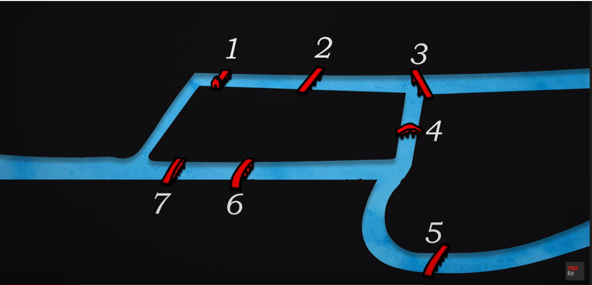

Origin of Graph Theory

Carl gottlieb Ehler was mayor of a konigsberg city.
The city had two islands connected two mainland with 7 bridges.

He was obsessed with an interesting problem of finding a path 
that crosses all the bridge only once. 
The path can start from any place and
end at any place with only condition 
that every bridge needs to be visited only once.

Look at the image below and try to find out a path 
that satisfies the above condition.

Take a moment to figure out such path.

The biggest insight that we have for this problem is,
whenever we take a bridge, we will land at some node or island.
At that island we have two possible choices
1) If the bridge we took was the last bridge that means we have found the path meeting all the constraints 
and the node we are landing is the last node.
2) If the bridge was not last bridge that means the node we are landing is an intermediary node, 
and we need to come out of the intermediary node to visit other nodes. If there are no new bridges coming out 
of the node that means we will be using the old bridges and thus violating the problem condition.
That means for an intermediary nodes, we need to have to as many outgoing bridges as incoming bridges.
which means total number of bridges connecting to an intermediary nodes should be even.
In case of source and destination nodes we can odd number of bridges connecting since we do not need to 
come out of the destination and we start from the source.

This problem lead to the creation of graph theory.
