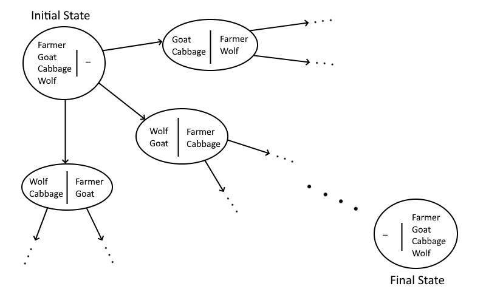

# Wolf, Goat and Cabbage Problem

The wolf, goat and cabbage problem is a river crossing puzzle. The problem is as follows:

*"Once upon a time a farmer went to a market and purchased a wolf, a goat, and a cabbage. On his way home, the farmer came to the bank of a river and rented a boat. But crossing the river by boat, the farmer could carry only himself and a single one of his purchases: the wolf, the goat, or the cabbage.*

*If left unattended together, the wolf would eat the goat, or the goat would eat the cabbage.*

*The farmer's challenge was to carry himself and his purchases to the far bank of the river, leaving each purchase intact. How did he do it?"*

## Overview of the Solution

The solution can be solved in the following steps:

- Convert the problem into a graph based problem
- Apply a shortest path algorithm

## Converting the Problem into a Graph Based Problem

This problem can be solved using graphs. This is because, this problem can be thought of as a set of states. Each state is a snapshot of the positions of the entities (wolf, goat and cabbage, henceforth referred to as "things") at any instant of time. These states can be thought of as vertices/nodes of a graph. Thus, the solution boils down to finding the path from the initial state (where all the things are on the left river bank) to the final state (where all the things are on the right river bank).



As seen above, the problem is modeled as a graph. The initial state is when all the things are on the left river bank. This state can transitition into three other states, one when the farmer takes the wolf with him to the right river bank (state at the top right, in the figure), one where the farmer takes the cabbage with him to the right river bank (state at the middle, in the figure), and one where the farmer takes the goat with him to the right river bank (state at the bottom left, in the figure).

From these new states, more states can emerge. Care should be taken that the conditions for an invalid state should be taken into account. For example, the state where the farmer takes the cabbage with him to the other side is invalid as the wolf and the goat are left alone together, and according to the problem, when this happens, the wolf will eat the goat.

## Algorithm Application

Since the resultant graph will be a graph whose edges are of unit weight, [Breath first search]( https://en.wikipedia.org/wiki/Breadth-first_search ) algorithm can be applied to find the path to the final state.

An overview of this part of the solution would be:

```
Step 1: Start
Step 2: Initialize the queue
Step 3: Initialize the visited array
Step 4: while size of q is not 0, repeat steps 5 to 10
Step 5: pop the state from queue
Step 6: check if this state has already been visited, if it has, run the next iteration
Step 7: print the state information
Step 8: add this state to the visited array
Step 9: generate next state (or states)
Step 10: add the generated states to the queue if they have not been visited
Step 11: Stop
```

When looked at carefully, this solution combines both breath first search and generation of the graph (step 9) together. This is in contrast to generating the graph first then applying breadth first search.

Also, there are two questions that stands out. How to represent the state in code? and how do you generate the next states?

## Representing State

The state can be represented in multiple ways. One method could be to make each state as a list containing a list of the things on the left bank as the first element, and a list of the things on the right bank as the second index. Another method would be to use classes.

One should also keep track of those states which have already been visited. To do this, it is necessary to map the complex state representation to a something simple, like an integer.

One way to do this would be to assign values for every thing. For the left river bank, add the values of the things, and for the right river bank, subtract the values of the things. The resultant will be an integer representing that state.

For example, consider this state:

```
leftSide = ['farmer', 'goat']
rightSide = ['wolf', 'cabbage']
```

Lets assign the values for each thing:

```
values = {'farmer': 10000, 'goat': 1, 'cabbage': 50, 'wolf': 100000}
```

Now, to calculate the resultant integer that represents this state (i.e., a key),

```
key_leftSide = values['farmer'] + value['goat']
key_rightSide =  - values['wolf'] - values['cabbage']
key = key_leftSide + key_rightSide
```

Which is

```
key_leftSide = 10000 + 1
key_rightSide = -100000 - 50
```

Which will result in the final key value being

```
key = 10001 - 100050
```

or

```
key = -90049
```

Therefore, the integer value that represents the state <br>`State: leftSide = ['farmer, goat'], rightSide = ['wolf', 'cabbage']` <br>is `-90049`.

## Generating States

The key part of the solution is to find a way to generate the next possible states one state can lead to. Looking at the problem, it can be seen that there are is one key condition that can make generating the next possible states easy. That condition is: __The farmer can only take one thing (or nothing) with him on the boat.__ 

Thus, the next states can be generated by moving the farmer along with one thing on the side the farmer is on, to the other side, at a time. 

## Conclusion

Now since all the necessary pieces of the problem have been put together, The code for it can be written. The code for this problem is [here](code/wolf_goat_cabbage.py).

